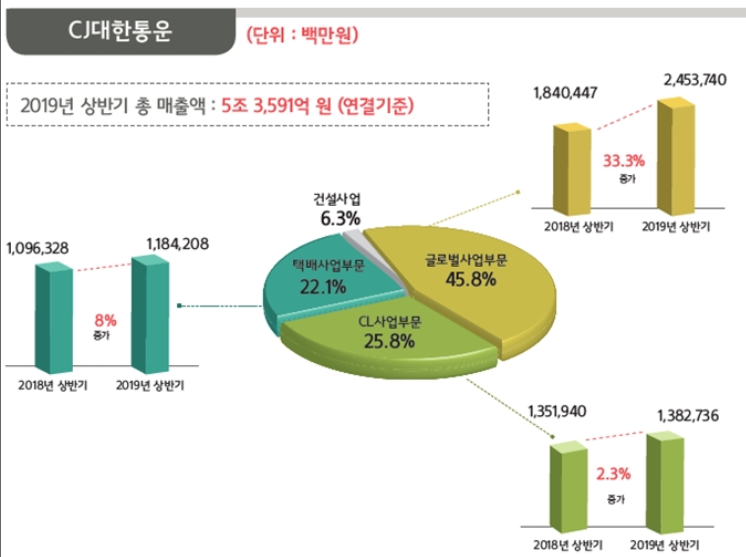
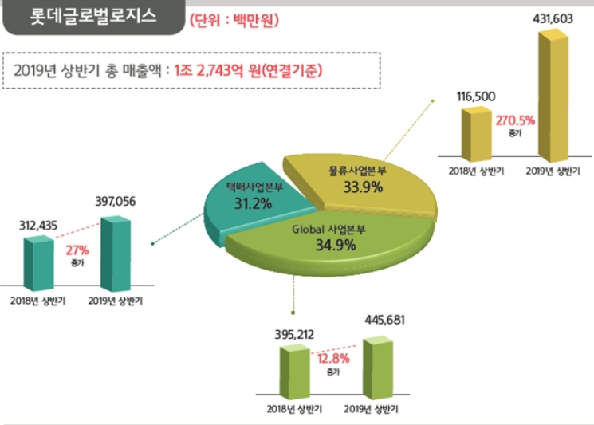
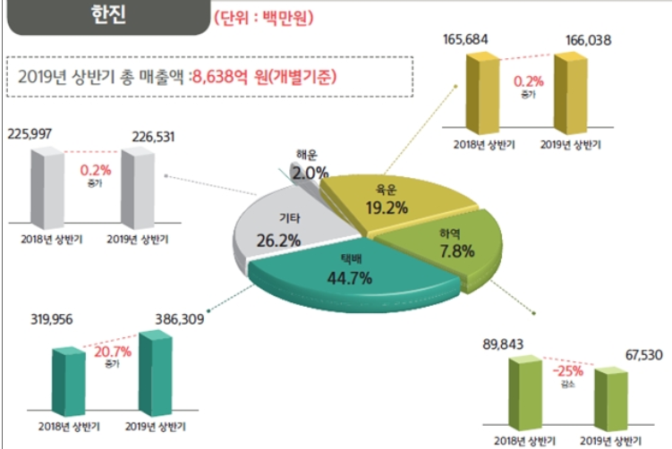

# 20190903 SCRAPBOOK
## [유통업계, ‘더운 추석’에 신선도 유지 총력…‘배송전쟁 시작’](http://www.klnews.co.kr/news/articleView.html?idxno=119940)
- 빠른 추석때문에 신선도 유지에 집중 
- **롯데백화점**
    - 배송 건수 지난 설 대비 10%가량 증가 예측 -> 배송 분야 인력 10%가량 늘린 6천 800여명 계획 
    - 신선도 유지를 위한 냉장 차량 지난해 추석 대비 10% 늘린 2천여대 확보
    - 신선식품을 생산하는 협력업체에서 선물세트를 직접 완제품으로 만들어 입고 -> 상품 품질 균질화 & 물류 단계 축소 -> 신선도 향상 
- **현대백화점**
    - 냉장·냉동 배송 차량을 지난해보다 30% 이상 확대 (1천600여대, 역대 최대)
    - 지난 추석 대비 인력 10% 확대 (물류센터: 3천900여명)
    - 신선도 유지를 위한 쿨러백 도입
        - **쿨러백**
            - 특수 제작한 보냉팩 사용 
            - 상온 2~3시간 신선도 유지 
            - 배송 시 발생할 수 있는 식중독균 99%억제 
    - *신선식품 배송 물량이 매년 5%이상 증가*
- **신세계백화점**
    - 배송 관련 인력 10% 확대 (5천여명)
    - 냉장,냉동 탑차와 일반 택배 차량 운영 지난해보다 5% 증가 예정 
    - 안전 중시!
        - 하루 평균 500여대 배송 차량 운영 
        - 차 한 대당 하루 배송 건수를 최대 40건
    - 배송 품질 강화 & 친환경 경영 
         - 분리배출과 재활용이 가능한 선물 패키지 
         - 냉장 식품 -> 종이로 만든 포장재 
         - 냉동 식품 -> 재사용이 가능한 보냉 가방 (가격은..?)
         - 재활용 불가능하던 아이스팩을 물로 된 보냉재로 대체도입하여 분리배출 가능하게 함 (더운 날씨 고려 예년보다 2배 넣음)
- **대형마트**
    - **이마트**
        - 콜드 체인 시스템 풀가동 
            - 축산 선물세트: '미트센터' 이용 
            - 과일과 굴비 선물세트: '후레쉬센터' 이용 
            - 보냉재: 접촉면을 늘리기 위해 적은 용량의 보냉재를 많이 넣음 
            - 진공포장 선물세트 증가  
 
## [PART 1. 2019년 상반기 물류기업 성장률 분석](http://www.klnews.co.kr/news/articleView.html?idxno=119929)
- 핵심사업의 경쟁력 강화 작업을 게을리하지 않으며 미래 성장동력 확보를 위한 신규 사업 발굴에도 많은 역량을 집중
- 최저임금 등 운영 원가 상승 -> 물류비 제값 받기 활동 전개 
- **롯데글로벌로지스**
    - 성장률 가장 높음 (지난해 상반기 대비 54.6% 성장)
        - 롯데로지스틱스&롯데글로벌로지스 합병 
        -  합병 후 롯데글로벌로지스는 인적·물적 네트워크를 보다 전문적으로 운영함과 동시에 관리 체계를 일원화하여 핵심 사업 경쟁력을 강화하고 있으며, 영업성과 개선 및 기업가치 극대화를 진행 중
    - 택배사업에 집중 
        - 중부권 메가 허브터미널, 의류통합물류센터 투자 계획
- **CJ대한통운**
    - 전기차 관련 사업
        - 현재 전기차를 활용하고 있지만 파워 등의 부분에서 부족 
        - 보완법: 충전 인프라 운영 계획(이미 주유소 사업을 추진한 경험을 토대로 충전소 사업 고려)
    - 목재수입유통업         
 
## [PART 2. 2019년 상반기 물류기업 사업별 매출 실적 분석](http://www.klnews.co.kr/news/articleView.html?idxno=119930)
- CJ대한통운

- 롯데글로벌로지스

- 한진 

- 택배 부문 꾸준한 성장세 
- 롯데글로벌로지스: **쿠팡 택배서비스 등을 수주**한 탓인지 택배사업부문 매출 27%로 가장 높게 성장 
 
## [바야흐로 ‘공유물류’의 시대가 왔다](http://www.klnews.co.kr/news/articleView.html?idxno=119902)
- 공유경제 기본원리: 유휴자산을 활용하는 것 
    - 개인이 사용할 떄는 활용이나 가동의 효율성이 떨어지는 것을 공동으로 이용함으로써 유지비용은 줄이고 수익을 극대화 하는 것 
- **물류센터**
    - 물류센터나 뮬류창고에서 사용하지 않는 공간을 공유해 수익 창출 
    - EXAMPLE 1 : Stowga (영국)
        - 기존 물류창고 내 남는 공간을 이를 필요로 하는 수요자와 공유하거나 나아가 공간 자체를 사고 파는 플랫폼 제공
    - EXAMPLE 2: 마이창고 (한국)
        - 물품을 저장할 공간을 필요로 하는 주 고객층인 온라인 쇼핑몰 사업자들이 판매하는 물품의 창고 입고는 물론 보관, 포장, 운송 단계까지 한 번에 해결해주는 서비스를 제공
- **노동력**
    - 기존 배송 기사가 전적으로 배송을 담당했던 시스템에서 이제 일반인이 자신의 자가용을 이용해 일정 금액의 수수료를 지급받고 배송
    - EXAMPLE 1: 아마존 플렉스 (미국)
        - 차량을 소유한 일반인들이 시간당 일정 수당을 받고 직접 아마존의 배달원이 되어 고객에게 직접 물건을 배송하는 형태를 전격 도입
    - EXAMPLE 2: 쿠팡플렉스 (한국)
 
## [‘한쪽 문으로도 괜찮겠지!’ 택배현장 안전불감증 여전해](http://www.klnews.co.kr/news/articleView.html?idxno=119903)
- 연간 5조 원이 훌쩍 넘는 택배 전성시대를 맞고 현실에서 택배배송 현장의 안전관리는 그 어느 때보다 중요
- 택배 본사의 안전관리 지침과 일선 택배영업소들의 꼼꼼한 배송현장 체크가 필요한 시점