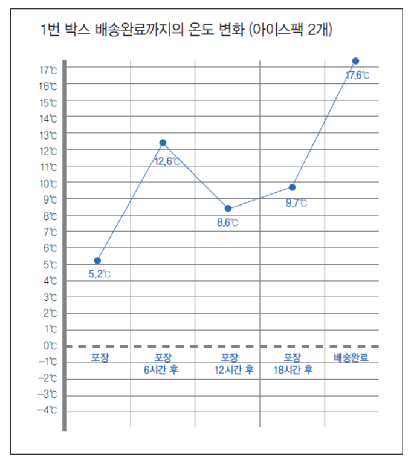
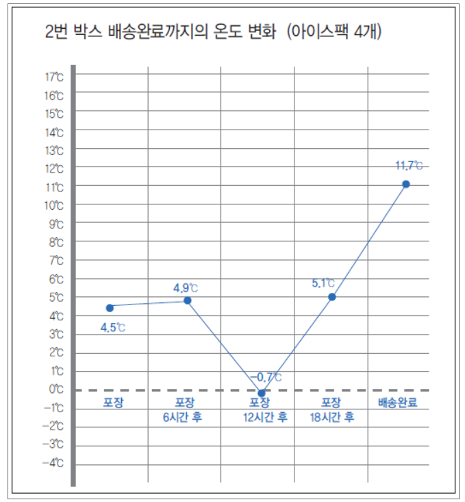
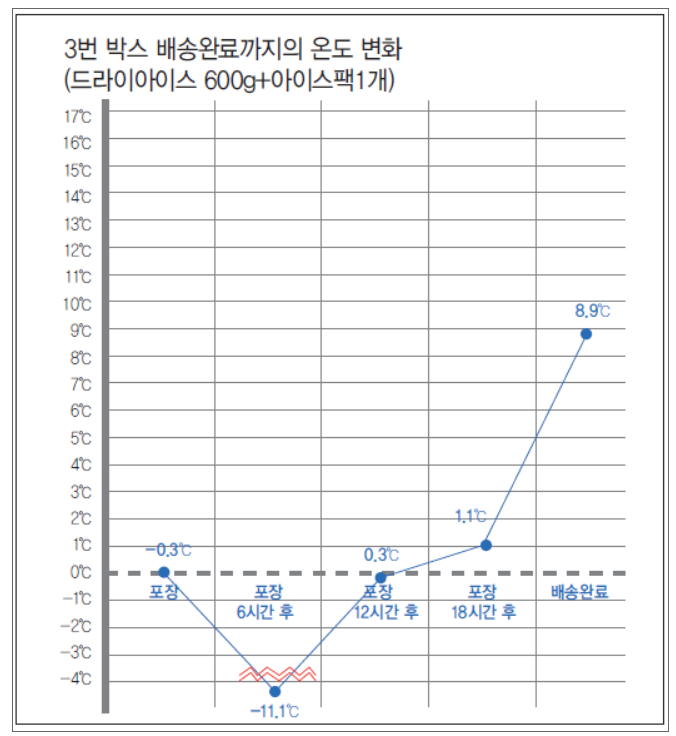
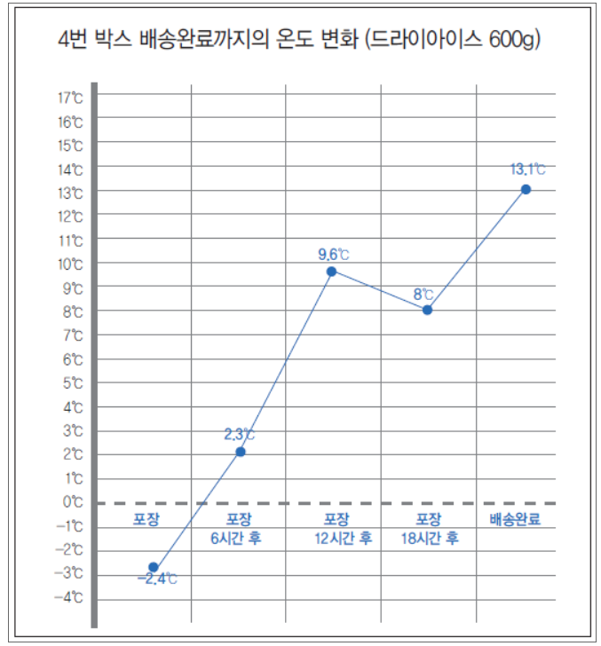
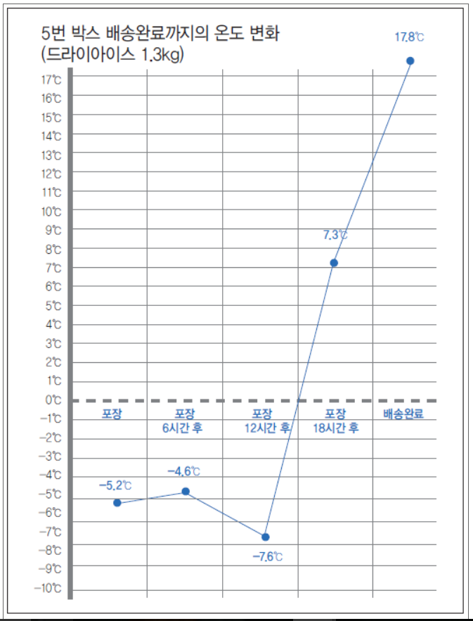

# 20190904 SCRAPBOOK
## [국내 택배업계 삼국지 – 그들의 비전과 전략은?](http://www.klnews.co.kr/news/articleView.html?idxno=119785)
- **CJ대한통운**
    - "2020년 물류 사업 부문에서 매출 25조 원, 영업이익 1조 원 달성" 목표를 향해
    - 국내 물류 센터 확보 
        - 2012, 경인항 김포물류센터 운영 시작 
        - 2013, 부산 신항에 친환경 물류센터 개장
        - 전국 택배서브터미널 분류 자동화 적용 (휠소터)
    - 서비스 향상 
        - 최초 편의점 픽업 서비스 도입 
        - 국내 최초 당일배송 서비스 시작 
    - 글로벌 시장 진출 
        - 중국
            - 2013, 중국 '스마트카고' 인수합병 
            - 2015 & 2016, 중국 '로킨', '스피덱스' 인수 
        - 말레이시아 
            - 2016, '센추리 로지스틱스' 인수합병 
        - 필리핀 
            - 2016, '트랜스내셔널 필리핀' 합작법인 
                - 동남아시아에 물류 한류 일으킴 
        - 베트남 
            - 2017, '제마뎁' 인수 
        - 미국 
            - 2018, 물류 기업 'DSC로지스틱스'인수 
- **한진**
    - 개인 대상으로 한 특화된 물류 서비스 제공 
        - 소비자가 집하 시간을 지정하는 집하 서비스 
        - 시간 지정 배송으로하는 플러스택배
        - 인천국제공항 내 택배 전용 카운터 개설 
            - 여객청사에서 발생하는 택배 건을 수도권 지역으로 당열 배송해주는 공항택배 실시 
        - 퀵 서비스와 손잡고 일반 택배보다 빠르고 퀵보다는 저렴한 '파발마 서비스' 도입 
            - 당일 4시간 이내 배송 및 반품, 실시간 집하 가능
        - 1인 가구를 위한 24시간 무인택배 서비스 적용 
- **롯데글로벌지스**
    - 롯데러지스틱 & 롯데글로벌로지스 합병 
    - 롯데쇼핑의 온라인배송센터를 양도받는 증 시설 확충 
    - 현대로지스틱스 인수함으로써 택배업계 등장 

## [‘국내시장 좁아’, 대신택배 동남아 물류시장 적극 공략](http://www.klnews.co.kr/news/articleView.html?idxno=119838)
- 국내 중량물 택배서비스 시장 독보적인 서비스 영역 확보 
- 말레이시아 쿠알라룸푸르 지점 구축 
    - 말레이시아 -> 동남아시아 신흥 부흥국으로 각종 물동량 증가 
        - 아세아 중심 위치
        - 이슬람, 화교, 인도계 종교 및 여러 다양한 문화 공존 
        - 높은 소비수준 
        - 영어 통용 
- 향후 수출입 통관, 컨테이너 내륙운송을 비롯해 벌크 수출입 포워딩, 공장설비 이전 등 특화된 물류서비스를 제공 전망 
- 2004, 호주, 뉴질랜드 대리점과 파트너쉽 체결 
- 현재 베트남 6개 지점 
- 중국, 캄보디아 등 해외 6개국 파트넘 및 지점 개설 
- '라인클리어' MOU 체결 
    - 한국, 말레이시아. 베트남을 잇는 원스톱 물류서비스 제공 
    - 라인클리어 
        - 현지 50개 이상 지점 
        - 국제특송 및 내륙운송, 창고보관 등 고객 맞춤형 물류서비스 제공 
        - 호평 얻고 있는 로컬 택배 
    - 대신택배 자회사인 대신국제운송과의 시너지 기대 
## [판토스, 러시아 최대 철도 물류 기업 ‘트랜스컨테이너’와 철송사업 확대](http://www.klnews.co.kr/news/articleView.html?idxno=119975)
- 러시아 최대 철도 운송업체 ‘PJSC TransContainer’와 함께 TSR 철도운송 사업 확대
- 한국·중국발(發) 우즈즈베키스탄, 러시아, 유럽, 카자흐스탄 향(向) 복합운송 사업 부문에서 적극 협력
- 우즈베키스탄 자동차 산업을 위한 물류 서비스를 공동 개발, 새로운 컨테이너 운송 루트 개발을 통해 신규 고객 유치에 적극 협력 계획
## [실험 3. 냉매 달리해서 직접 택배 보내봤더니…](http://www.klnews.co.kr/news/articleView.html?idxno=119983)
- 
- 
- 
- 
- 
- 결론: 적어도 24시간 이내에 배송이 완료되어야함 
## [UPS, 드론 배송 현실화 눈 앞](http://www.klnews.co.kr/news/articleView.html?idxno=119767)
- UPS: 세계 최대 규모 특송 회사이자 공급망 서비스 리더 
- 상업용 드론 운영을 위한 Part135 인증 신청 
- 현재 드론 의약품 배송 서비스 활용中
- 미국 노스캐롤라이나 주 롤리(Raleigh)에 위치한 웨이크메드(WakeMed) 병원 본원과 분원에 의약품을 운송